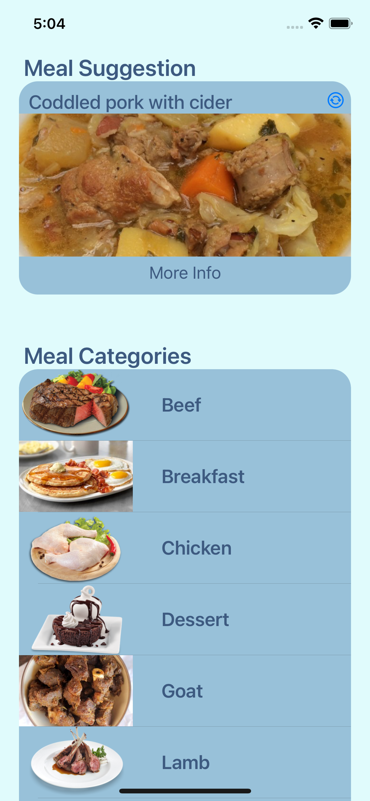

# Foodie
An iOS app to view more details of your favorite meals, as well as find new meals to try out!

## Features
* A new meal is suggested at app launch or when refresh button is selected.
* Find instructions and ingredients for your favorite recipes.
* Increase your palette through the ease of finding new recipes.

## Screenshots 

    
        
    

## Technologies Used  
* Swift
* Programmatic UI
* UIKit
* MVC  
* Networking using URLSession
* MealDB API
* Image Caching

**No third-party libraries used**
